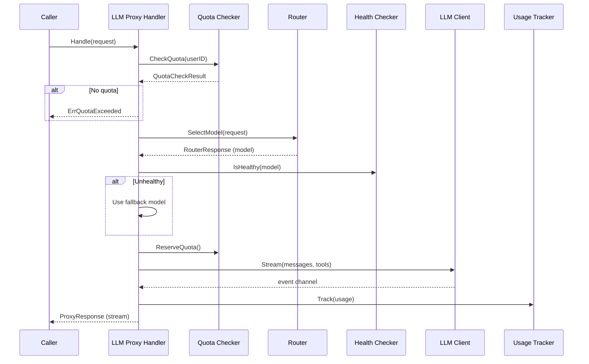

# LLM Proxy Request Flow

LLM proxy request processing through quota, routing, health, and usage tracking.

```mermaid
sequenceDiagram
    participant C as Caller
    participant H as LLM Proxy Handler
    participant Q as Quota Checker
    participant R as Router
    participant HC as Health Checker
    participant L as LLM Client
    participant U as Usage Tracker

    C->>H: Handle(request)
    H->>Q: CheckQuota(userID)
    Q-->>H: QuotaCheckResult

    alt No quota
        H-->>C: ErrQuotaExceeded
    end

    H->>R: SelectModel(request)
    R-->>H: RouterResponse (model)

    H->>HC: IsHealthy(model)
    alt Unhealthy
        H->>H: Use fallback model
    end

    H->>Q: ReserveQuota()

    H->>L: Stream(messages, tools)
    L-->>H: event channel

    H->>U: Track(usage)

    H-->>C: ProxyResponse (stream)
```
