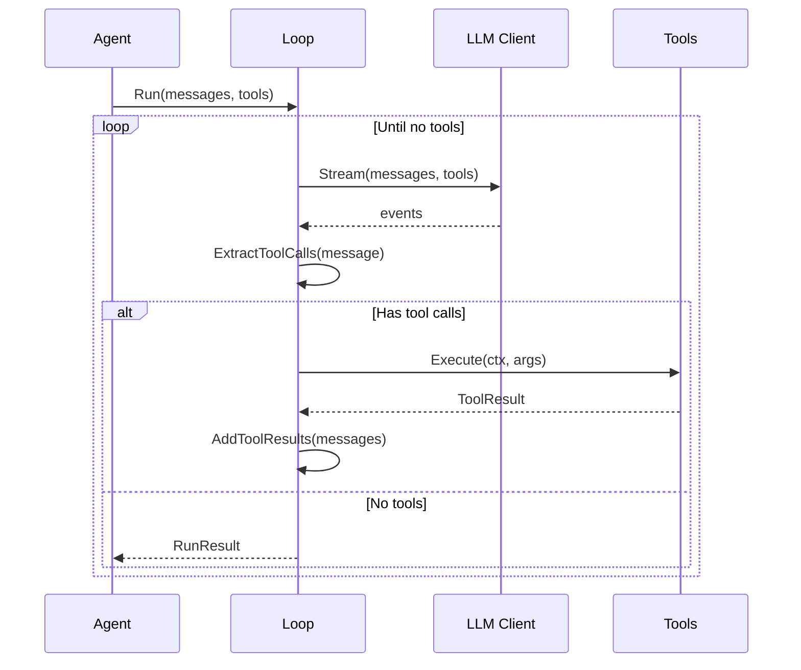

# Agent Tool Loop Flow

Tool calling execution loop.

```mermaid
sequenceDiagram
    participant A as Agent
    participant L as Loop
    participant C as LLM Client
    participant T as Tools

    A->>L: Run(messages, tools)
    loop Until no tools
        L->>C: Stream(messages, tools)
        C-->>L: events

        L->>L: ExtractToolCalls(message)

        alt Has tool calls
            L->>T: Execute(ctx, args)
            T-->>L: ToolResult
            L->>L: AddToolResults(messages)
        else No tools
            L-->>A: RunResult
        end
    end
```
