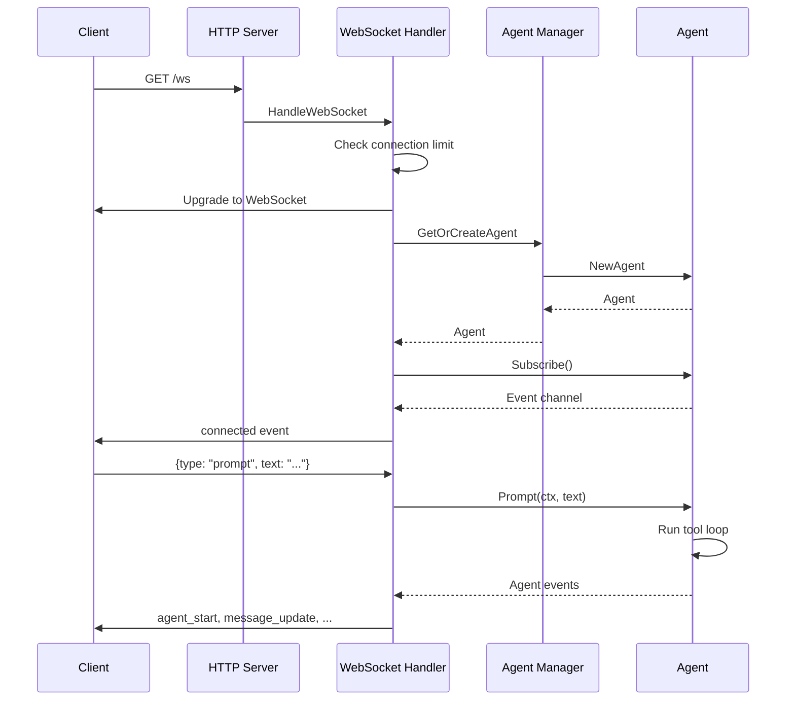

# WebSocket Connection Flow

Client connection and agent initialization sequence.

```mermaid
sequenceDiagram
    participant C as Client
    participant H as HTTP Server
    participant W as WebSocket Handler
    participant A as Agent Manager
    participant AG as Agent

    C->>H: GET /ws
    H->>W: HandleWebSocket
    W->>W: Check connection limit
    W->>C: Upgrade to WebSocket

    W->>A: GetOrCreateAgent
    A->>AG: NewAgent
    AG-->>A: Agent
    A-->>W: Agent

    W->>AG: Subscribe()
    AG-->>W: Event channel

    W->>C: connected event

    C->>W: {type: "prompt", text: "..."}
    W->>AG: Prompt(ctx, text)
    AG->>AG: Run tool loop
    AG-->>W: Agent events
    W->>C: agent_start, message_update, ...
```
