# LLM Proxy Health

Circuit breaker pattern for provider health monitoring.

### IsHealthy

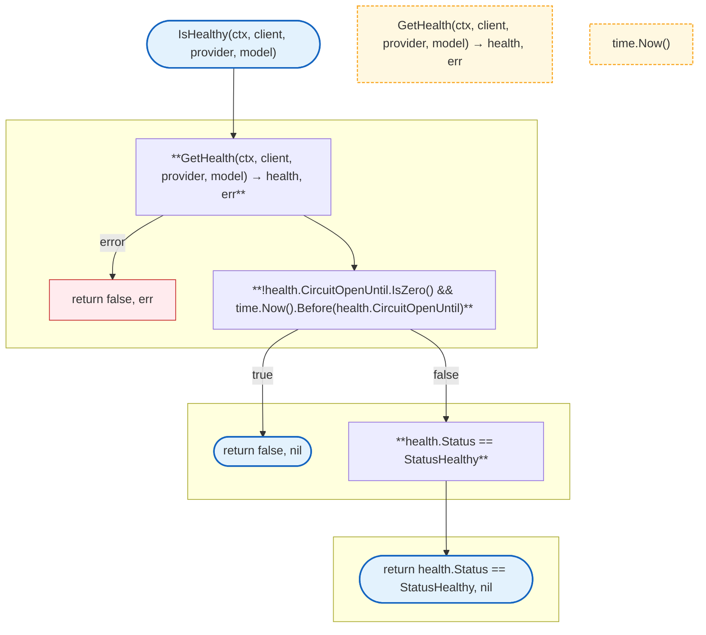
```mermaid
flowchart TB
    Start(["IsHealthy(ctx, client, provider, model)"]) --> HGetHealth

    subgraph SGGetHealth [" "]
        HGetHealth["**GetHealth(ctx, client, provider, model) → health, err**"]
        HGetHealth -->|error| E1["return false, err"]
        HGetHealth --> HCheckCircuit
    end

    subgraph SGCheckCircuit [" "]
        HCheckCircuit["**!health.CircuitOpenUntil.IsZero() && time.Now().Before(health.CircuitOpenUntil)**"]
        HCheckCircuit -->|true| ReturnFalse(["return false, nil"])
        HCheckCircuit -->|false| HCheckStatus
    end

    subgraph SGCheckStatus [" "]
        HCheckStatus["**health.Status == StatusHealthy**"]
        HCheckStatus --> Return(["return health.Status == StatusHealthy, nil"])
    end

    GetHealth["GetHealth(ctx, client, provider, model) → health, err"]
    Now["time.Now()"]

    click GetHealth href "#gethealth"
    click Now href "https://pkg.go.dev/time#Now"

    classDef mainFn fill:#e3f2fd,stroke:#1565c0,stroke-width:2px
    classDef localPkgs fill:#fff8e1,stroke:#f9a825,stroke-width:1.5px,stroke-dasharray:4 2
    classDef errorFlow fill:#ffebee,stroke:#c62828,stroke-width:1px

    class Start,Return,ReturnFalse mainFn
    class GetHealth,Now localPkgs
    class E1 errorFlow
```

### GetHealth

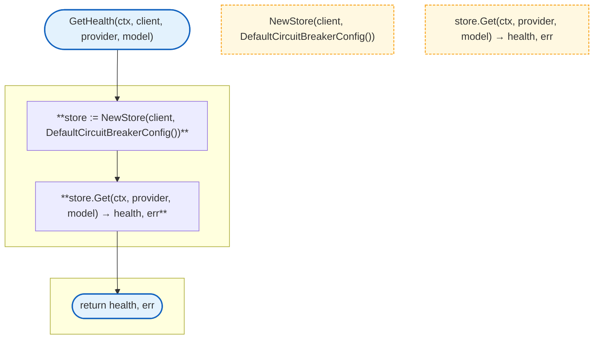
```mermaid
flowchart TB
    Start(["GetHealth(ctx, client, provider, model)"]) --> HNewStore

    subgraph SGNewStore [" "]
        HNewStore["**store := NewStore(client, DefaultCircuitBreakerConfig())**"]
        HNewStore --> HStoreGet
    end

    subgraph SGStoreGet [" "]
        HStoreGet["**store.Get(ctx, provider, model) → health, err**"]
        HStoreGet --> Return(["return health, err"])
    end

    NewStore["NewStore(client, DefaultCircuitBreakerConfig())"]
    StoreGet["store.Get(ctx, provider, model) → health, err"]

    click NewStore href "#newstore"
    click StoreGet href "#store-get"

    classDef mainFn fill:#e3f2fd,stroke:#1565c0,stroke-width:2px
    classDef localPkgs fill:#fff8e1,stroke:#f9a825,stroke-width:1.5px,stroke-dasharray:4 2

    class Start,Return mainFn
    class NewStore,StoreGet localPkgs
```

### RecordSuccess

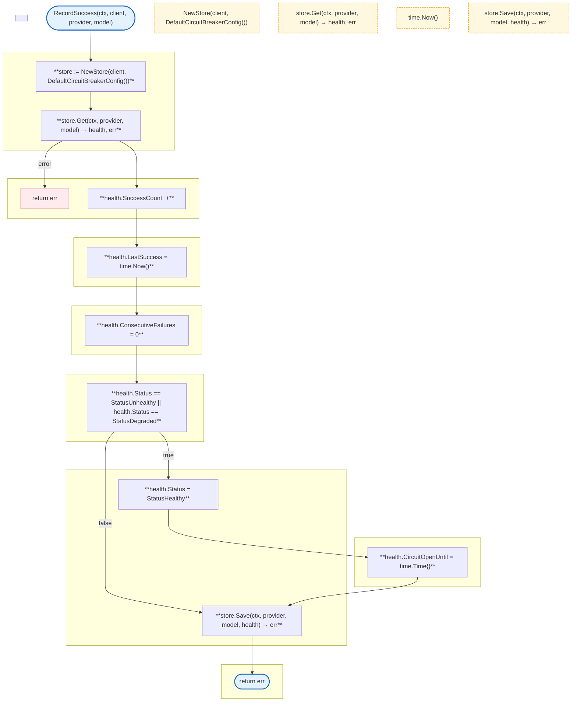
```mermaid
flowchart TB
    Start(["RecordSuccess(ctx, client, provider, model)"]) --> HNewStore

    subgraph SGNewStore [" "]
        HNewStore["**store := NewStore(client, DefaultCircuitBreakerConfig())**"]
        HNewStore --> HStoreGet
    end

    subgraph SGStoreGet [" "]
        HStoreGet["**store.Get(ctx, provider, model) → health, err**"]
        HStoreGet -->|error| E1["return err"]
        HStoreGet --> HUpdate
    end

    subgraph SGUpdate [" "]
        HUpdate["**health.SuccessCount++**"]
        HUpdate --> HSetLastSuccess
    end

    subgraph SGSetLastSuccess [" "]
        HSetLastSuccess["**health.LastSuccess = time.Now()**"]
        HSetLastSuccess --> HResetFailures
    end

    subgraph SGResetFailures [" "]
        HResetFailures["**health.ConsecutiveFailures = 0**"]
        HResetFailures --> HCheckStatus
    end

    subgraph SGCheckStatus [" "]
        HCheckStatus["**health.Status == StatusUnhealthy || health.Status == StatusDegraded**"]
        HCheckStatus -->|true| HSetHealthy
        HCheckStatus -->|false| HSave
    end

    subgraph SGSetHealthy [" "]
        HSetHealthy["**health.Status = StatusHealthy**"]
        HSetHealthy --> HClearCircuit
    end

    subgraph SGClearCircuit [" "]
        HClearCircuit["**health.CircuitOpenUntil = time.Time{}**"]
        HClearCircuit --> HSave
    end

    subgraph SGSave [" "]
        HSave["**store.Save(ctx, provider, model, health) → err**"]
        HSave --> Return(["return err"])
    end

    NewStore["NewStore(client, DefaultCircuitBreakerConfig())"]
    StoreGet["store.Get(ctx, provider, model) → health, err"]
    Now["time.Now()"]
    StoreSave["store.Save(ctx, provider, model, health) → err"]

    click NewStore href "#newstore"
    click StoreGet href "#store-get"
    click Now href "https://pkg.go.dev/time#Now"
    click StoreSave href "#store-save"

    classDef mainFn fill:#e3f2fd,stroke:#1565c0,stroke-width:2px
    classDef localPkgs fill:#fff8e1,stroke:#f9a825,stroke-width:1.5px,stroke-dasharray:4 2
    classDef errorFlow fill:#ffebee,stroke:#c62828,stroke-width:1px

    class Start,Return mainFn
    class NewStore,StoreGet,Now,StoreSave localPkgs
    class E1 errorFlow
```

### RecordFailure

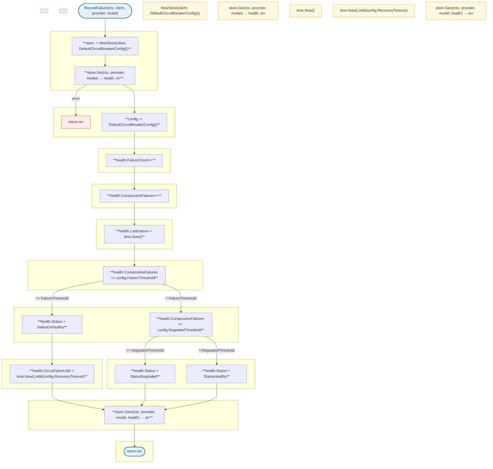
```mermaid
flowchart TB
    Start(["RecordFailure(ctx, client, provider, model)"]) --> HNewStore

    subgraph SGNewStore [" "]
        HNewStore["**store := NewStore(client, DefaultCircuitBreakerConfig())**"]
        HNewStore --> HStoreGet
    end

    subgraph SGStoreGet [" "]
        HStoreGet["**store.Get(ctx, provider, model) → health, err**"]
        HStoreGet -->|error| E1["return err"]
        HStoreGet --> HGetConfig
    end

    subgraph SGGetConfig [" "]
        HGetConfig["**config := DefaultCircuitBreakerConfig()**"]
        HGetConfig --> HUpdateFailures
    end

    subgraph SGUpdateFailures [" "]
        HUpdateFailures["**health.FailureCount++**"]
        HUpdateFailures --> HIncConsecutive
    end

    subgraph SGIncConsecutive [" "]
        HIncConsecutive["**health.ConsecutiveFailures++**"]
        HIncConsecutive --> HSetLastFailure
    end

    subgraph SGSetLastFailure [" "]
        HSetLastFailure["**health.LastFailure = time.Now()**"]
        HSetLastFailure --> HCheckThreshold
    end

    subgraph SGCheckThreshold [" "]
        HCheckThreshold["**health.ConsecutiveFailures >= config.FailureThreshold**"]
        HCheckThreshold -->|>= FailureThreshold| HSetUnhealthy
        HCheckThreshold -->|< FailureThreshold| HCheckDegraded
    end

    subgraph SGSetUnhealthy [" "]
        HSetUnhealthy["**health.Status = StatusUnhealthy**"]
        HSetUnhealthy --> HSetCircuitOpen
    end

    subgraph SGSetCircuitOpen [" "]
        HSetCircuitOpen["**health.CircuitOpenUntil = time.Now().Add(config.RecoveryTimeout)**"]
        HSetCircuitOpen --> HSave
    end

    subgraph SGCheckDegraded [" "]
        HCheckDegraded["**health.ConsecutiveFailures >= config.DegradedThreshold**"]
        HCheckDegraded -->|>= DegradedThreshold| HSetDegraded
        HCheckDegraded -->|< DegradedThreshold| HSetHealthy
    end

    subgraph SGSetDegraded [" "]
        HSetDegraded["**health.Status = StatusDegraded**"]
        HSetDegraded --> HSave
    end

    subgraph SGSetHealthy [" "]
        HSetHealthy["**health.Status = StatusHealthy**"]
        HSetHealthy --> HSave
    end

    subgraph SGSave [" "]
        HSave["**store.Save(ctx, provider, model, health) → err**"]
        HSave --> Return(["return err"])
    end

    NewStore["NewStore(client, DefaultCircuitBreakerConfig())"]
    StoreGet["store.Get(ctx, provider, model) → health, err"]
    Now["time.Now()"]
    AddTimeout["time.Now().Add(config.RecoveryTimeout)"]
    StoreSave["store.Save(ctx, provider, model, health) → err"]

    click NewStore href "#newstore"
    click StoreGet href "#store-get"
    click Now href "https://pkg.go.dev/time#Now"
    click AddTimeout href "https://pkg.go.dev/time#Time.Add"
    click StoreSave href "#store-save"

    classDef mainFn fill:#e3f2fd,stroke:#1565c0,stroke-width:2px
    classDef localPkgs fill:#fff8e1,stroke:#f9a825,stroke-width:1.5px,stroke-dasharray:4 2
    classDef errorFlow fill:#ffebee,stroke:#c62828,stroke-width:1px

    class Start,Return mainFn
    class NewStore,StoreGet,Now,AddTimeout,StoreSave localPkgs
    class E1 errorFlow
```

### GetAllHealth

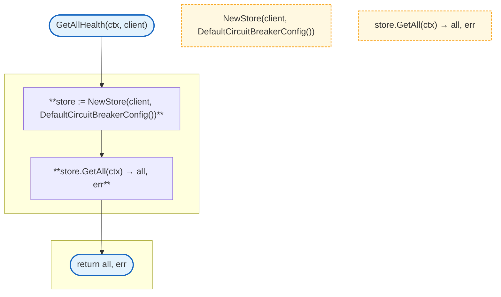
```mermaid
flowchart TB
    Start(["GetAllHealth(ctx, client)"]) --> HNewStore

    subgraph SGNewStore [" "]
        HNewStore["**store := NewStore(client, DefaultCircuitBreakerConfig())**"]
        HNewStore --> HStoreGetAll
    end

    subgraph SGStoreGetAll [" "]
        HStoreGetAll["**store.GetAll(ctx) → all, err**"]
        HStoreGetAll --> Return(["return all, err"])
    end

    NewStore["NewStore(client, DefaultCircuitBreakerConfig())"]
    StoreGetAll["store.GetAll(ctx) → all, err"]

    click NewStore href "#newstore"
    click StoreGetAll href "#store-getall"

    classDef mainFn fill:#e3f2fd,stroke:#1565c0,stroke-width:2px
    classDef localPkgs fill:#fff8e1,stroke:#f9a825,stroke-width:1.5px,stroke-dasharray:4 2

    class Start,Return mainFn
    class NewStore,StoreGetAll localPkgs
```

### ResetHealth

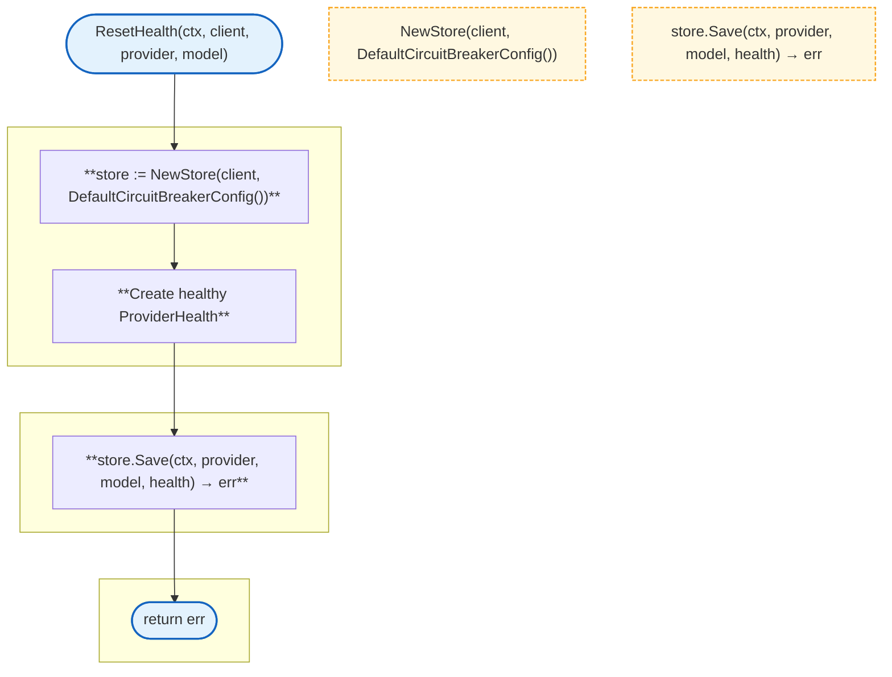
```mermaid
flowchart TB
    Start(["ResetHealth(ctx, client, provider, model)"]) --> HNewStore

    subgraph SGNewStore [" "]
        HNewStore["**store := NewStore(client, DefaultCircuitBreakerConfig())**"]
        HNewStore --> HCreateHealth
    end

    subgraph SGCreateHealth [" "]
        HCreateHealth["**Create healthy ProviderHealth**"]
        HCreateHealth --> HStoreSave
    end

    subgraph SGStoreSave [" "]
        HStoreSave["**store.Save(ctx, provider, model, health) → err**"]
        HStoreSave --> Return(["return err"])
    end

    NewStore["NewStore(client, DefaultCircuitBreakerConfig())"]
    StoreSave["store.Save(ctx, provider, model, health) → err"]

    click NewStore href "#newstore"
    click StoreSave href "#store-save"

    classDef mainFn fill:#e3f2fd,stroke:#1565c0,stroke-width:2px
    classDef localPkgs fill:#fff8e1,stroke:#f9a825,stroke-width:1.5px,stroke-dasharray:4 2

    class Start,Return mainFn
    class NewStore,StoreSave localPkgs
```

### GetUnhealthyModels

```mermaid
flowchart TB
    Start(["GetUnhealthyModels(ctx, client)"]) --> HNewStore

    subgraph SGNewStore [" "]
        HNewStore["**store := NewStore(client, DefaultCircuitBreakerConfig())**"]
        HNewStore --> HStoreGetAll
    end

    subgraph SGStoreGetAll [" "]
        HStoreGetAll["**store.GetAll(ctx) → all, err**"]
        HStoreGetAll -->|error| E1["return nil, err"]
        HStoreGetAll --> HIterate
    end

    subgraph SGIterate [" "]
        HIterate["**for key, health := range all**"]
        HIterate --> HCheck
    end

    subgraph SGCheck [" "]
        HCheck["**health.Status == StatusUnhealthy**"]
        HCheck -->|true| HAppend["unhealthy = append(unhealthy, key)"]
        HAppend --> HIterate
        HCheck -->|false| HIterate
        HIterate --> Return
    end

    Return(["return unhealthy, nil"])

    NewStore["NewStore(client, DefaultCircuitBreakerConfig())"]
    StoreGetAll["store.GetAll(ctx) → all, err"]

    click NewStore href "#newstore"
    click StoreGetAll href "#store-getall"

    classDef mainFn fill:#e3f2fd,stroke:#1565c0,stroke-width:2px
    classDef localPkgs fill:#fff8e1,stroke:#f9a825,stroke-width:1.5px,stroke-dasharray:4 2
    classDef errorFlow fill:#ffebee,stroke:#c62828,stroke-width:1px

    class Start,Return mainFn
    class NewStore,StoreGetAll localPkgs
    class E1 errorFlow
```

### GetDegradedModels

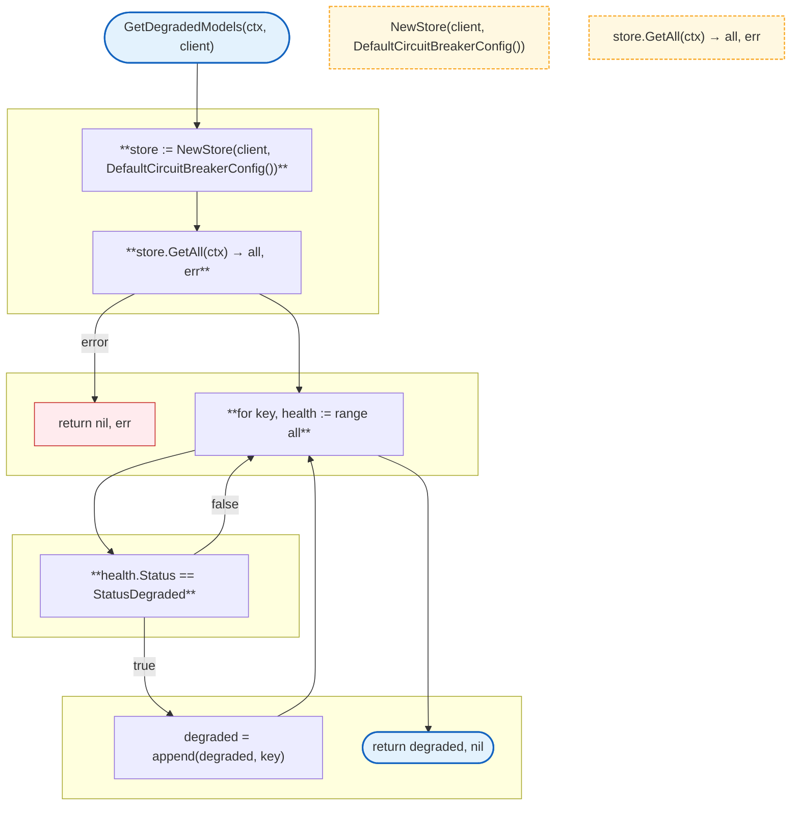
```mermaid
flowchart TB
    Start(["GetDegradedModels(ctx, client)"]) --> HNewStore

    subgraph SGNewStore [" "]
        HNewStore["**store := NewStore(client, DefaultCircuitBreakerConfig())**"]
        HNewStore --> HStoreGetAll
    end

    subgraph SGStoreGetAll [" "]
        HStoreGetAll["**store.GetAll(ctx) → all, err**"]
        HStoreGetAll -->|error| E1["return nil, err"]
        HStoreGetAll --> HIterate
    end

    subgraph SGIterate [" "]
        HIterate["**for key, health := range all**"]
        HIterate --> HCheck
    end

    subgraph SGCheck [" "]
        HCheck["**health.Status == StatusDegraded**"]
        HCheck -->|true| HAppend["degraded = append(degraded, key)"]
        HAppend --> HIterate
        HCheck -->|false| HIterate
        HIterate --> Return
    end

    Return(["return degraded, nil"])

    NewStore["NewStore(client, DefaultCircuitBreakerConfig())"]
    StoreGetAll["store.GetAll(ctx) → all, err"]

    click NewStore href "#newstore"
    click StoreGetAll href "#store-getall"

    classDef mainFn fill:#e3f2fd,stroke:#1565c0,stroke-width:2px
    classDef localPkgs fill:#fff8e1,stroke:#f9a825,stroke-width:1.5px,stroke-dasharray:4 2
    classDef errorFlow fill:#ffebee,stroke:#c62828,stroke-width:1px

    class Start,Return mainFn
    class NewStore,StoreGetAll localPkgs
    class E1 errorFlow
```

### ShouldRateLimit

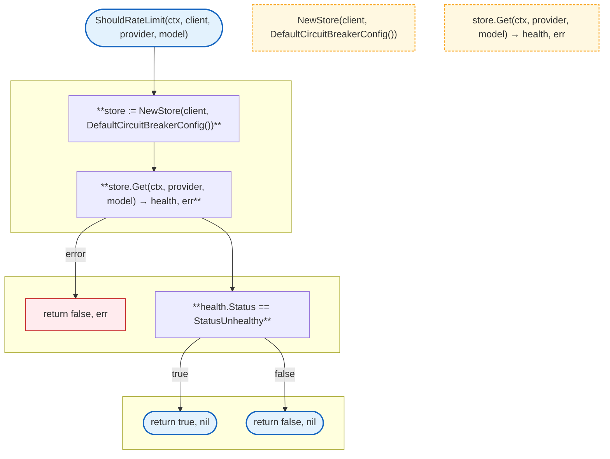
```mermaid
flowchart TB
    Start(["ShouldRateLimit(ctx, client, provider, model)"]) --> HNewStore

    subgraph SGNewStore [" "]
        HNewStore["**store := NewStore(client, DefaultCircuitBreakerConfig())**"]
        HNewStore --> HStoreGet
    end

    subgraph SGStoreGet [" "]
        HStoreGet["**store.Get(ctx, provider, model) → health, err**"]
        HStoreGet -->|error| E1["return false, err"]
        HStoreGet --> HCheck
    end

    subgraph SGCheck [" "]
        HCheck["**health.Status == StatusUnhealthy**"]
        HCheck -->|true| ReturnTrue(["return true, nil"])
        HCheck -->|false| Return(["return false, nil"])
    end

    NewStore["NewStore(client, DefaultCircuitBreakerConfig())"]
    StoreGet["store.Get(ctx, provider, model) → health, err"]

    click NewStore href "#newstore"
    click StoreGet href "#store-get"

    classDef mainFn fill:#e3f2fd,stroke:#1565c0,stroke-width:2px
    classDef localPkgs fill:#fff8e1,stroke:#f9a825,stroke-width:1.5px,stroke-dasharray:4 2
    classDef errorFlow fill:#ffebee,stroke:#c62828,stroke-width:1px

    class Start,Return,ReturnTrue mainFn
    class NewStore,StoreGet localPkgs
    class E1 errorFlow
```

### DefaultCircuitBreakerConfig

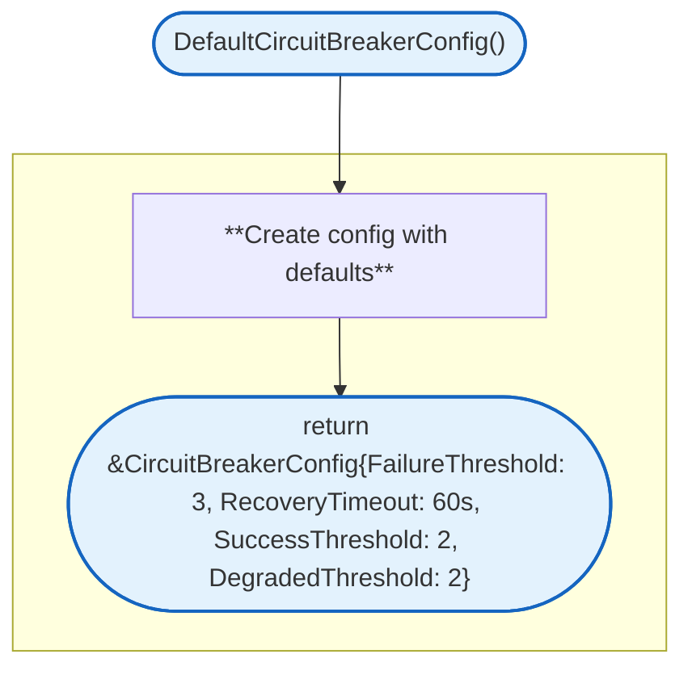
```mermaid
flowchart TB
    Start(["DefaultCircuitBreakerConfig()"]) --> HCreate

    subgraph SGCreate [" "]
        HCreate["**Create config with defaults**"]
        HCreate --> Return(["return &CircuitBreakerConfig{FailureThreshold: 3, RecoveryTimeout: 60s, SuccessThreshold: 2, DegradedThreshold: 2}"])
    end

    classDef mainFn fill:#e3f2fd,stroke:#1565c0,stroke-width:2px

    class Start,Return mainFn
```

### NewStore

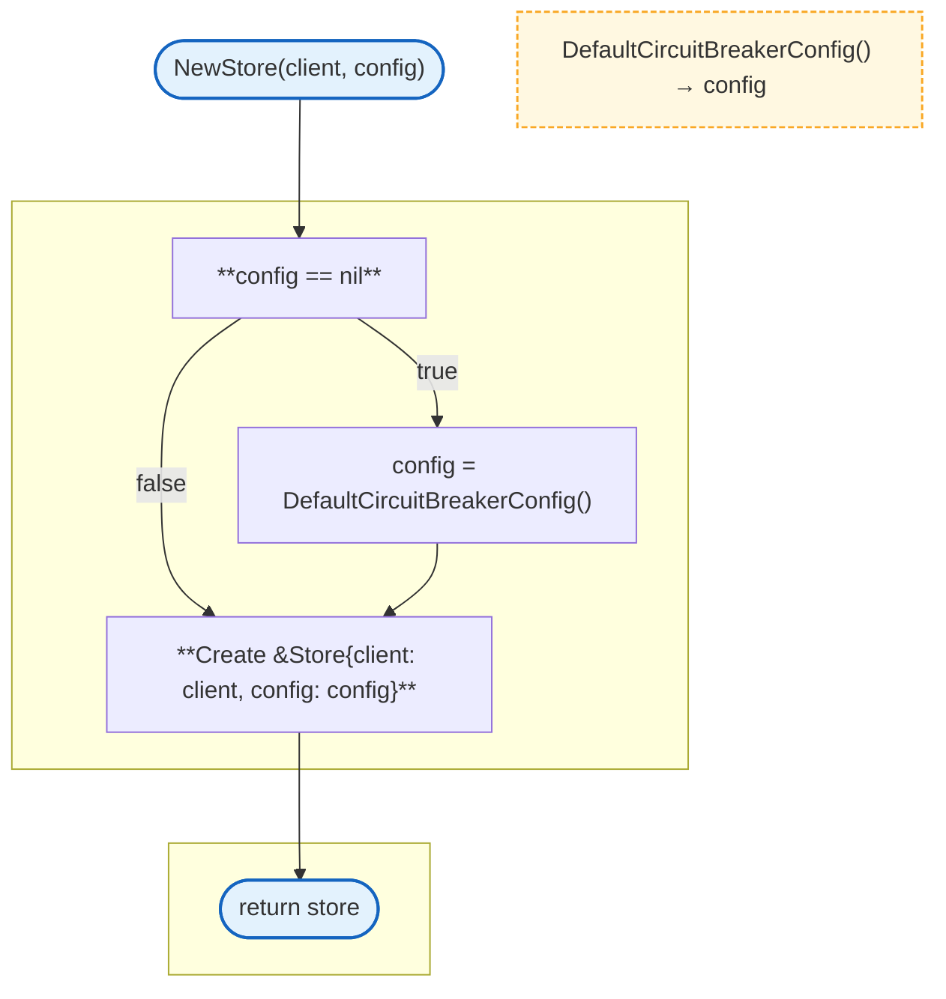
```mermaid
flowchart TB
    Start(["NewStore(client, config)"]) --> HCheckConfig

    subgraph SGCheckConfig [" "]
        HCheckConfig["**config == nil**"]
        HCheckConfig -->|true| HDefault["config = DefaultCircuitBreakerConfig()"]
        HCheckConfig -->|false| HCreate
        HDefault --> HCreate
    end

    subgraph SGCreate [" "]
        HCreate["**Create &Store{client: client, config: config}**"]
        HCreate --> Return(["return store"])
    end

    DefaultConfig["DefaultCircuitBreakerConfig() → config"]

    click DefaultConfig href "#defaultcircuitbreakerconfig"

    classDef mainFn fill:#e3f2fd,stroke:#1565c0,stroke-width:2px
    classDef localPkgs fill:#fff8e1,stroke:#f9a825,stroke-width:1.5px,stroke-dasharray:4 2

    class Start,Return mainFn
    class DefaultConfig localPkgs
```

### Store.Get

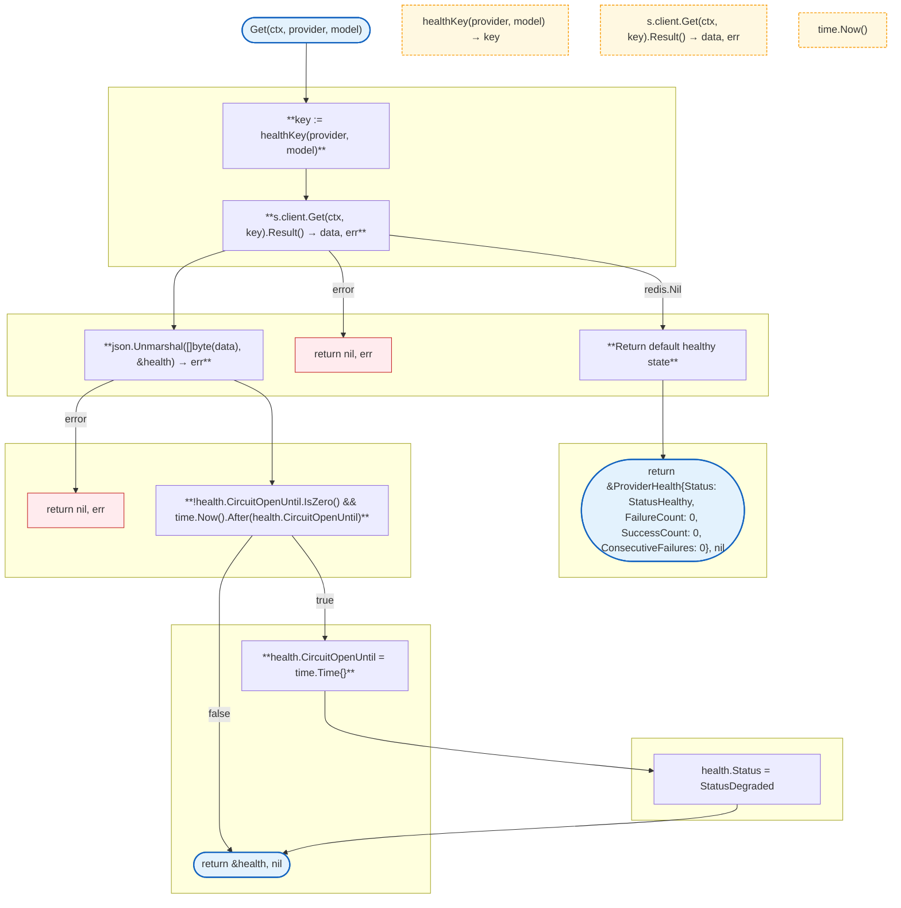
```mermaid
flowchart TB
    Start(["Get(ctx, provider, model)"]) --> HGenerateKey

    subgraph SGGenerateKey [" "]
        HGenerateKey["**key := healthKey(provider, model)**"]
        HGenerateKey --> HGet
    end

    subgraph SGGet [" "]
        HGet["**s.client.Get(ctx, key).Result() → data, err**"]
        HGet -->|redis.Nil| HDefault
        HGet -->|error| E1["return nil, err"]
        HGet --> HUnmarshal
    end

    subgraph SGDefault [" "]
        HDefault["**Return default healthy state**"]
        HDefault --> Return(["return &ProviderHealth{Status: StatusHealthy, FailureCount: 0, SuccessCount: 0, ConsecutiveFailures: 0}, nil"])
    end

    subgraph SGUnmarshal [" "]
        HUnmarshal["**json.Unmarshal([]byte(data), &health) → err**"]
        HUnmarshal -->|error| E2["return nil, err"]
        HUnmarshal --> HCheckCircuit
    end

    subgraph SGCheckCircuit [" "]
        HCheckCircuit["**!health.CircuitOpenUntil.IsZero() && time.Now().After(health.CircuitOpenUntil)**"]
        HCheckCircuit -->|true| HClearCircuit
        HCheckCircuit -->|false| ReturnHealth
    end

    subgraph SGClearCircuit [" "]
        HClearCircuit["**health.CircuitOpenUntil = time.Time{}**"]
        HClearCircuit --> HSetDegraded["health.Status = StatusDegraded"]
        HSetDegraded --> ReturnHealth
    end

    ReturnHealth(["return &health, nil"])

    HealthKey["healthKey(provider, model) → key"]
    RedisGet["s.client.Get(ctx, key).Result() → data, err"]
    Now["time.Now()"]

    click HealthKey href "#healthkey"
    click RedisGet href "https://pkg.go.dev/github.com/redis/go-redis/v9#Client.Get"
    click Now href "https://pkg.go.dev/time#Now"

    classDef mainFn fill:#e3f2fd,stroke:#1565c0,stroke-width:2px
    classDef localPkgs fill:#fff8e1,stroke:#f9a825,stroke-width:1.5px,stroke-dasharray:4 2
    classDef errorFlow fill:#ffebee,stroke:#c62828,stroke-width:1px

    class Start,Return,ReturnHealth mainFn
    class HealthKey,RedisGet,Now localPkgs
    class E1,E2 errorFlow
```

### Store.Save

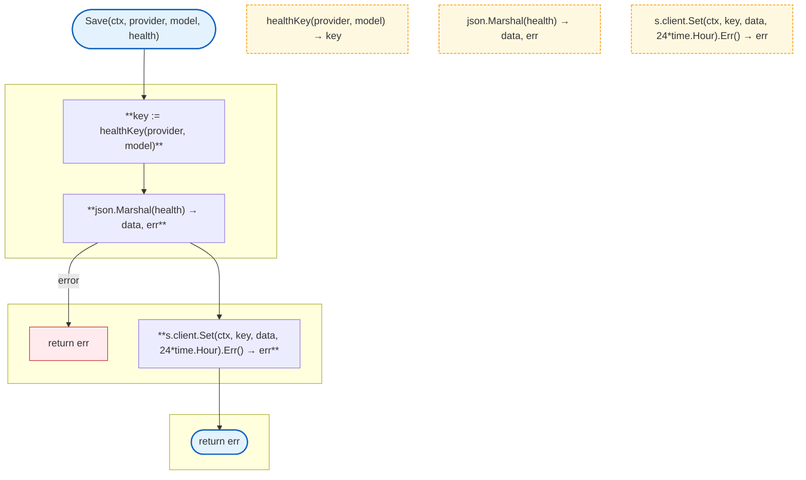
```mermaid
flowchart TB
    Start(["Save(ctx, provider, model, health)"]) --> HGenerateKey

    subgraph SGGenerateKey [" "]
        HGenerateKey["**key := healthKey(provider, model)**"]
        HGenerateKey --> HMarshal
    end

    subgraph SGMarshal [" "]
        HMarshal["**json.Marshal(health) → data, err**"]
        HMarshal -->|error| E1["return err"]
        HMarshal --> HSet
    end

    subgraph SGSet [" "]
        HSet["**s.client.Set(ctx, key, data, 24*time.Hour).Err() → err**"]
        HSet --> Return(["return err"])
    end

    HealthKey["healthKey(provider, model) → key"]
    Marshal["json.Marshal(health) → data, err"]
    SetRedis["s.client.Set(ctx, key, data, 24*time.Hour).Err() → err"]

    click HealthKey href "#healthkey"
    click Marshal href "https://pkg.go.dev/encoding/json#Marshal"
    click SetRedis href "https://pkg.go.dev/github.com/redis/go-redis/v9#Client.Set"

    classDef mainFn fill:#e3f2fd,stroke:#1565c0,stroke-width:2px
    classDef localPkgs fill:#fff8e1,stroke:#f9a825,stroke-width:1.5px,stroke-dasharray:4 2
    classDef errorFlow fill:#ffebee,stroke:#c62828,stroke-width:1px

    class Start,Return mainFn
    class HealthKey,Marshal,SetRedis localPkgs
    class E1 errorFlow
```

### Store.GetAll

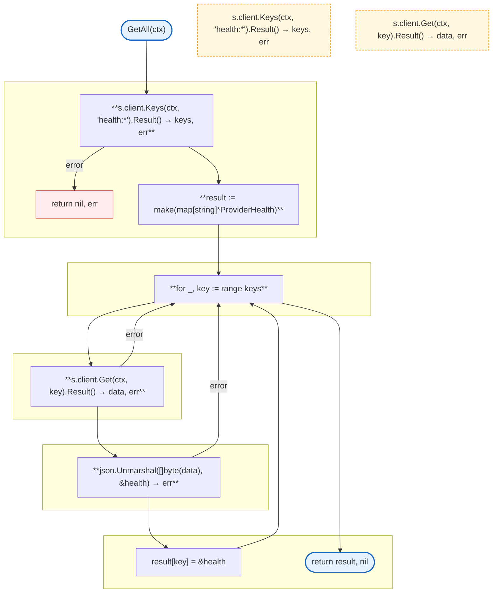
```mermaid
flowchart TB
    Start(["GetAll(ctx)"]) --> HKeys

    subgraph SGKeys [" "]
        HKeys["**s.client.Keys(ctx, 'health:*').Result() → keys, err**"]
        HKeys -->|error| E1["return nil, err"]
        HKeys --> HCreateMap
    end

    subgraph SGCreateMap [" "]
        HCreateMap["**result := make(map[string]*ProviderHealth)**"]
        HCreateMap --> HIterate
    end

    subgraph SGIterate [" "]
        HIterate["**for _, key := range keys**"]
        HIterate --> HGet
    end

    subgraph SGGet [" "]
        HGet["**s.client.Get(ctx, key).Result() → data, err**"]
        HGet -->|error| HIterate
        HGet --> HUnmarshal
    end

    subgraph SGUnmarshal [" "]
        HUnmarshal["**json.Unmarshal([]byte(data), &health) → err**"]
        HUnmarshal -->|error| HIterate
        HUnmarshal --> HStore["result[key] = &health"]
        HStore --> HIterate
        HIterate --> Return
    end

    Return(["return result, nil"])

    KeysRedis["s.client.Keys(ctx, 'health:*').Result() → keys, err"]
    GetRedis["s.client.Get(ctx, key).Result() → data, err"]

    click KeysRedis href "https://pkg.go.dev/github.com/redis/go-redis/v9#Client.Keys"
    click GetRedis href "https://pkg.go.dev/github.com/redis/go-redis/v9#Client.Get"

    classDef mainFn fill:#e3f2fd,stroke:#1565c0,stroke-width:2px
    classDef localPkgs fill:#fff8e1,stroke:#f9a825,stroke-width:1.5px,stroke-dasharray:4 2
    classDef errorFlow fill:#ffebee,stroke:#c62828,stroke-width:1px

    class Start,Return mainFn
    class KeysRedis,GetRedis localPkgs
    class E1 errorFlow
```

### healthKey

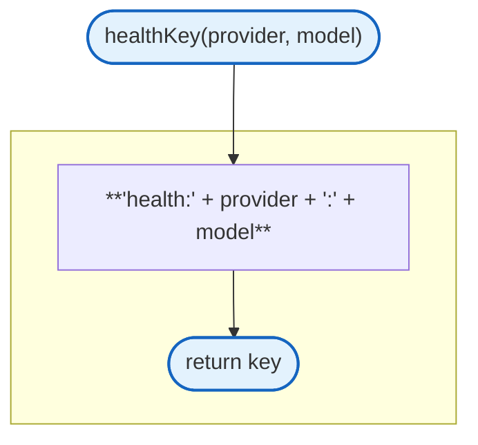
```mermaid
flowchart TB
    Start(["healthKey(provider, model)"]) --> HConcat

    subgraph SGConcat [" "]
        HConcat["**'health:' + provider + ':' + model**"]
        HConcat --> Return(["return key"])
    end

    classDef mainFn fill:#e3f2fd,stroke:#1565c0,stroke-width:2px

    class Start,Return mainFn
```

## Structs

### Service

| Struct | Field | Type | Description |
|--------|-------|------|-------------|
| `Service` | `store` | `*Store` | Health store |

### Store

| Struct | Field | Type | Description |
|--------|-------|------|-------------|
| `Store` | `client` | `*redis.Client` | Redis client |
| | `config` | `*CircuitBreakerConfig` | Circuit breaker config |

### ProviderHealth

| Struct | Field | Type | Description |
|--------|-------|------|-------------|
| `ProviderHealth` | `Status` | `HealthStatus` | Health status |
| | `FailureCount` | `int` | Total failures |
| | `SuccessCount` | `int` | Total successes |
| | `LastFailure` | `time.Time` | Last failure time |
| | `LastSuccess` | `time.Time` | Last success time |
| | `ConsecutiveFailures` | `int` | Consecutive failures |
| | `CircuitOpenUntil` | `time.Time` | Circuit open timeout |

### CircuitBreakerConfig

| Struct | Field | Type | Description |
|--------|-------|------|-------------|
| `CircuitBreakerConfig` | `FailureThreshold` | `int` | Failures to trip circuit |
| | `RecoveryTimeout` | `time.Duration` | Time before recovery attempt |
| | `SuccessThreshold` | `int` | Successes to close circuit |
| | `DegradedThreshold` | `int` | Failures to mark degraded |

## HealthStatus

| Constant | Type | Value | Description |
|----------|------|-------|-------------|
| `StatusHealthy` | `HealthStatus` | `"healthy"` | Normal operation |
| `StatusDegraded` | `HealthStatus` | `"degraded"` | Some failures |
| `StatusUnhealthy` | `HealthStatus` | `"unhealthy"` | Circuit open |

## Configuration

| Setting | Default | Description |
|---------|---------|-------------|
| FailureThreshold | 3 | Failures before opening circuit |
| RecoveryTimeout | 60s | Time before half-open |
| SuccessThreshold | 2 | Successes to close circuit |
| DegradedThreshold | 2 | Failures to mark degraded |

## Redis Keys

| Key Pattern | Description |
|-------------|-------------|
| `health:{provider}:{model}` | Health data for provider:model |

Health data is stored as JSON with 24-hour expiration.

## Related

- [LLM Proxy README](README.md) - Main proxy documentation
